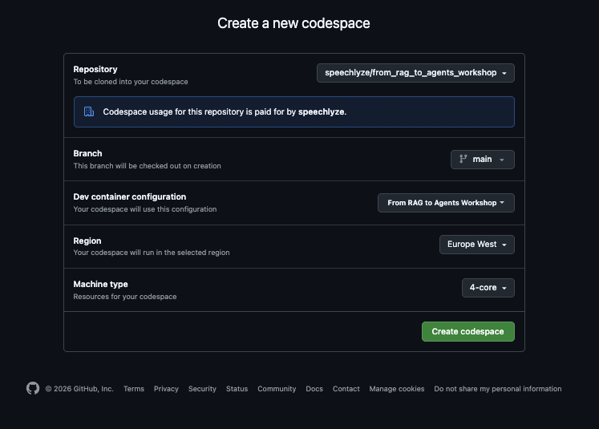
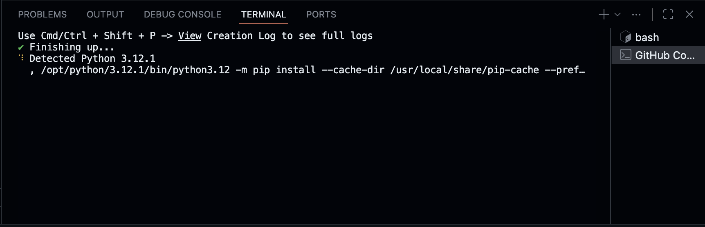
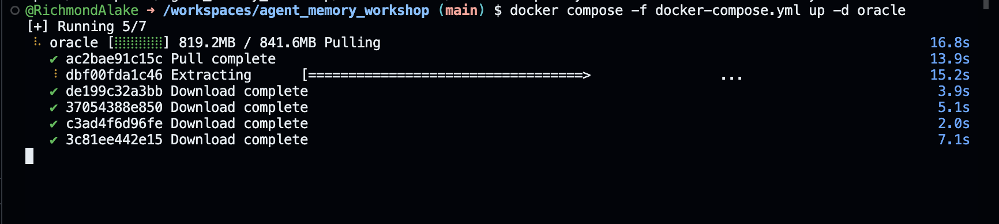

# Information Retrieval to RAG Workshop

**Build a complete information retrieval and RAG pipeline with Oracle AI Database and OCI GenAI (xAI Grok 3 Fast)**

[](https://codespaces.new/speechlyze/information_retrieval_to_RAG)

---

## What You Will Build

Starting from raw data, you will construct a **Research Paper Assistant** — a system that retrieves and reasons over 200 ArXiv papers stored in Oracle AI Database. Along the way you'll implement five retrieval strategies (keyword, vector, hybrid, and graph) and build an end-to-end RAG pipeline that connects Oracle retrieval to OCI GenAI (xAI Grok 3 Fast).

## Workshop Parts

| Part | Topic | Guide |
|---|---|---|
| 1 | Oracle AI Database setup and connection | [Part 1 Guide](docs/part-1-oracle-setup.md) |
| 2 | Data loading and embedding generation | [Part 2 Guide](docs/part-2-data-loading.md) |
| 3 | Database table setup and data ingestion | [Part 3 Guide](docs/part-3-table-setup.md) |
| 4 | Retrieval mechanisms (keyword, vector, hybrid, graph) | [Part 4 Guide](docs/part-4-retrieval.md) |
| 5 | Building a RAG pipeline | [Part 5 Guide](docs/part-5-rag-pipeline.md) |

> **[TODO Checklist](docs/TODO-checklist.md)** — all 7 tasks at a glance with links to their guide sections.

## Getting Started

### Option A: GitHub Codespaces (recommended for the workshop)

1. Click the **Open in GitHub Codespaces** badge above
2. Click the **Create Codespace** button to launch your environment

   

3. Wait for the environment to build (~3-5 minutes)

   

4. Once the terminal prompt appears, start Oracle AI Database:

   > **Tip:** If your browser prompts you to allow clipboard pasting, click **Allow** so you can paste commands into the terminal.

   ```bash
   docker compose -f .devcontainer/docker-compose.yml up -d oracle
   ```

   

5. Wait for Oracle to become healthy (~60-90 seconds), then verify:
   ```bash
   docker ps
   ```
   You should see `(healthy)` in the STATUS column for the `oracle-free` container.

   

6. Confirm the Python connection works:
   ```bash
   python3 -c "import oracledb; c = oracledb.connect(user='VECTOR', password='VectorPwd_2025', dsn='localhost:1521/FREEPDB1'); print('Connected. Oracle version:', c.version); c.close()"
   ```

   

7. Open [`workshop/notebook_student.ipynb`](workshop/notebook_student.ipynb) in the file explorer
8. Select the **Information Retrieval to RAG Workshop** kernel from the top-right kernel picker
9. Follow the notebook cells top to bottom, using the part guides in `docs/` when you hit a TODO

You will need:
- A GitHub account (free)
- `OCI_GENAI_API_KEY` and `TAVILY_API_KEY` are pre-configured as Codespace environment variables — no manual setup required

> **Note:** On subsequent Codespace opens, Oracle should start automatically via `postStartCommand`. If you ever see a connection error in the notebook, run step 4 above again from the terminal.

### Option B: Local development

```bash
git clone https://github.com/speechlyze/information_retrieval_to_RAG
cd information_retrieval_to_RAG

# Start Oracle AI Database
docker compose -f .devcontainer/docker-compose.yml up -d oracle

# Install dependencies
pip install -r requirements.txt

# Launch Jupyter
jupyter lab workshop/notebook_student.ipynb
```

Wait approximately 2 minutes for Oracle to initialise before running notebook cells.

## Workshop Files

```
information_retrieval_to_RAG/
├── .devcontainer/
│   ├── devcontainer.json       Codespaces configuration
│   ├── docker-compose.yml      Oracle AI Database container
│   ├── setup_build.sh          Dependency installation and kernel registration
│   ├── setup_runtime.sh        Oracle startup and vector memory configuration
│   ├── start_oracle.sh         Oracle health check on Codespace restart
│   └── oracle-init/
│       └── 01_vector_memory.sql  Vector memory pool initialisation
├── workshop/
│   ├── notebook_student.ipynb    Your working notebook (contains TODO gaps)
│   └── notebook_complete.ipynb   Complete reference (do not open until done)
├── docs/
│   ├── part-1-oracle-setup.md
│   ├── part-2-data-loading.md
│   ├── part-3-table-setup.md
│   ├── part-4-retrieval.md
│   ├── part-5-rag-pipeline.md
│   └── TODO-checklist.md
├── images/
├── requirements.txt
└── README.md
```

## Stack

- Oracle AI Database via `gvenzl/oracle-free:23-full`
- `sentence-transformers` — local embedding model (nomic-embed-text-v1.5, 768-dim), no API key needed
- `oracledb` — Python Oracle driver
- `OCI GenAI` — LLM generation (xAI Grok 3 Fast via OpenAI-compatible endpoint)

## Where to Next?

- **[From RAG to Agents Workshop](https://github.com/speechlyze/from_rag_to_agents_workshop)** — Continue the journey by adding AI agents, multi-agent orchestration, and persistent session memory on top of this RAG pipeline
- **[Oracle AI Developer Hub](https://github.com/oracle-devrel/oracle-ai-developer-hub)** — More technical assets, samples, and projects with Oracle AI
- **[Oracle Developer Resource](https://www.oracle.com/developer/)** — Documentation, tools, and community for Oracle developers

---

Built for the Oracle AI Developer Experience team.
